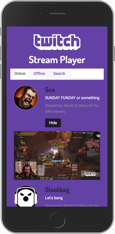

# Twitch Stream Player

Watch live streams and search for new streams from the comfort of my app.

### Live Demo

[index.html](https://adamelliotfields.github.io/twitch-player-app/index.html)

### Libraries
[jQuery](http://jquery.com)  
[Bootstrap CSS](https://v4-alpha.getbootstrap.com)  
[Bootstrap JS](https://v4-alpha.getbootstrap.com)  
[Tether](http://tether.io) (required by Bootstrap JS)

### API
[Twitch](https://dev.twitch.tv)

### Notes

*This is a clone of [adamelliotfields/free-code-camp/front-end-development/7-twitch-player](https://github.com/adamelliotfields/free-code-camp/tree/master/front-end-development/7-twitch-player).*

*This app was coded from scratch, start-to-finish, and was not based off of any tutorial.*

The requirements of this project were to sort and display Twitch streamers based on their status (online, offline, or non-existent) and also include a link to their channel.

The Twitch Streams endpoint will either respond with `null` if the streamer is offline, or an object if they are online. Regardless, you will always get a response even if the username is invalid.

The Channels endpoint will respond with an error if the channel doesn't exist, but doesn't distinguish between online and offline streams.

My solution was to loop through an array of streamers and try the Streams endpoint first. If the response was null, I would then try the Channels endpoint, and then use a deferred `.fail()` callback if there was an error.

I then wanted to add embedded video with a slide down panel. I ran into an issue with resizing the embedded `<iframe>` since iframes are not responsive. I solved this with a simple `$.on('resize')` event handler. The width of the iframe is set to 30 pixels less than the width of its container, and the height is set to 9/16 of the width (Twitch videos are 16:9 AR).

In the event that nobody is online (or offline), I added messages to the appropriate divs. I ran into an issue because the messages would append before all the AJAX calls had resolved. This is because while the `forEach` loop is synchronous, the AJAX calls are async. Instead of using promises, arrays of promises, and counter variables like proposed on Stack Overflow, I used a simple `$(document).ajaxStop()` callback. Once all AJAX calls have been resolved, my code runs. Simple as that.

For typography I'm using Google Fonts Dosis and Roboto. These closely match the Kovalev and Helvetica Nueue fonts used by Twitch. The color palette is also the same as the Twitch site.

Overall this was a fun build and gave me an excuse to watch Twitch. Now I really want to play some WoW :neckbeard:
